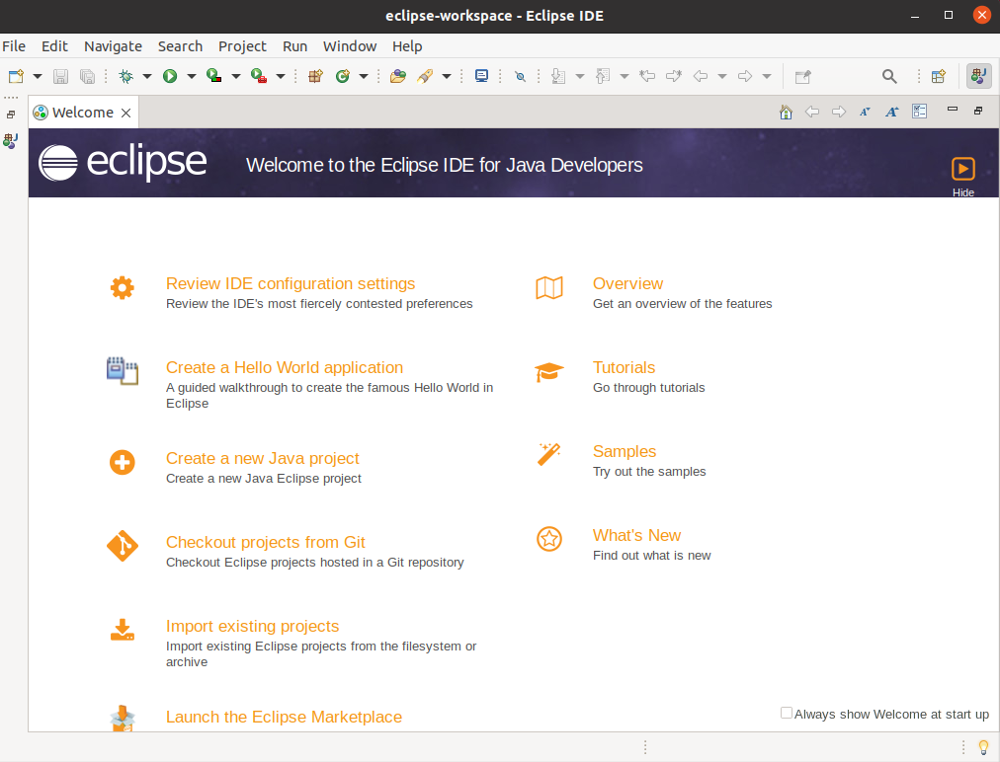

# Realizar-la-instalacion-de-Eclipse-en-el-SO

**Nombre:** Marlon Farizo Hergueta.

**Curso:** 1º Desarrollo de Aplicaciones Web.

**Asignatura:** Entornos de desarrollo.

### ÍNDICE

+ [Instalación de Eclipse](#id1)
+ [Ejecutando Netbeans 12](#id2)

### Instalación de Eclipse 

En primer lugar vamos a poner el comando para instalar el Eclipse.

### Ejecutando Eclipse 

Escribimos en el terminal Eclipse y se abrira nuestro programa.

